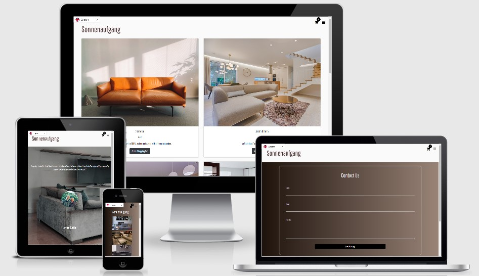

# Sonnenaufgang

Sonnenaufgang is a prestigious family run Sofa designer based in Munich that has been trading since 1884. Sonnenaufgang has evolved over the last 100 years as one of the most famous Sofa specialists with a wide range of material, colours, design and sizes of Sofas. This website has been created to revolutionise the business by providing customers with the option to shop online instead of instore. Helping reach a wider variety of customers. Such a demands has become necessary during the recent Covid-19 Pandemic and this website enables Sonnenaufgang to compete with the larger intercontinental franchises.

